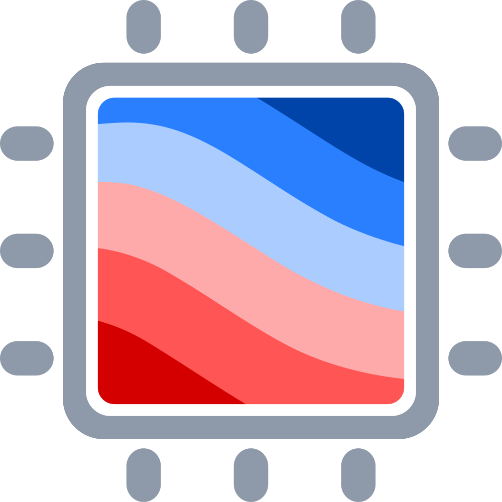
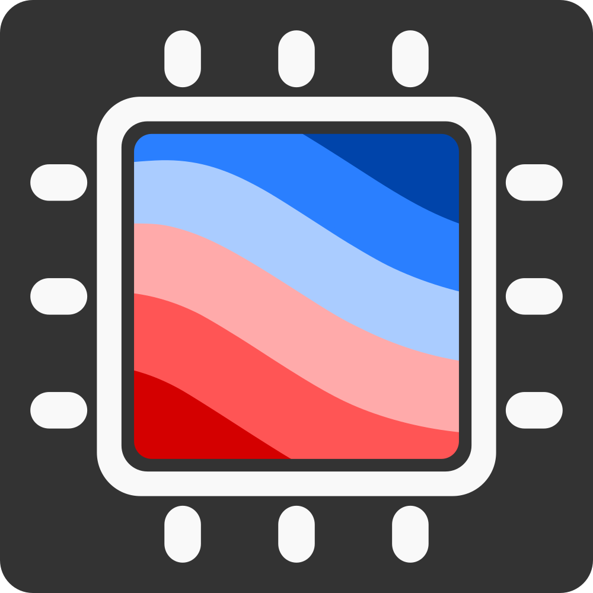
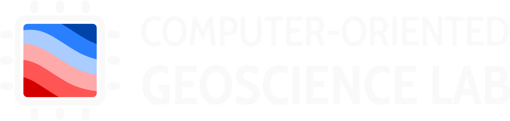

# Logo and branding material for the group

The logo was generated in [Inkscape](https://inkscape.org). Vector files (SVG)
are the original sources. PNGs are also available for use in social media, etc.

