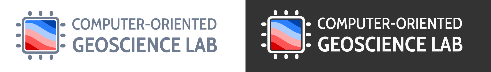

# Logo and branding material for the group

The logo was generated in [Inkscape](https://inkscape.org). Vector files (SVG)
are the original sources. PNGs are also available for use in social media, etc.

Use these files in presentations, posters, etc, about work done in the context
of the lab.
